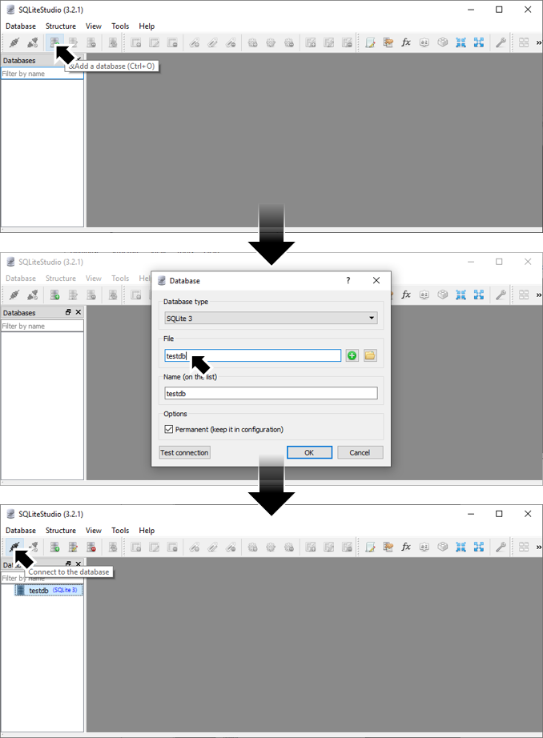
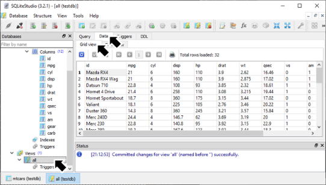

# [atet](https://github.com/atet) / [learn](https://github.com/atet/learn) / [sql](https://github.com/atet/learn/tree/master/sql)

# Introduction to SQL

* Estimated time to completion: 15 minutes.
* This quick introduction to [Structured Query Language (SQL)](https://en.wikipedia.org/wiki/SQL) is meant to cover only the absolute necessary material to get you up and running in a minimal amount of time.
* You are here because you want to use SQL to manage (view, extract, and/or manipulate) data in a [Relational Database Management System (RDMS)](https://en.wikipedia.org/wiki/Relational_database#RDBMS).
* We will be using [SQLite](https://www.sqlite.org/index.html) to perform basic operations; advanced material is not covered here.

--------------------------------------------------------------------------------------------------

### Table of Contents

#### Introduction
* [0. Requirements](#0-requirements)
* [1. Installation](#1-installation)
* [2. Example Data](#2-example-data)
* [3. Loading Data](#3-loading-data)
* [4. Navigation](#4-navigation)
* [5. Your First Query](#5-your-first-query)
* [6. Data Manipulation Concept](#6-data-manipulation-concept)
* [7. Data Manipulation Queries](#7-data-manipulation-queries)
* [8. Experiment](#8-experiment)

#### Supplemental
* [Epilogue](#Epilogue)
* [Troubleshooting](#troubleshooting)
* [SQLite vs. other SQL implementations](#sqlite-vs-other-sql-implementations)
* [Acknowledgements](#acknowledgements)

--------------------------------------------------------------------------------------------------

### 0. Requirements
* This tutorial was developed on Microsoft Windows 10.
* SQLite and SQLiteStudio is also available for MacOS and Linux.

[Back to Top](#table-of-contents)

--------------------------------------------------------------------------------------------------

### 1. Installation

* We will use SQLiteStudio, which is a Graphical User Interface (GUI) created for SQLite: [https://sqlitestudio.pl/index.rvt?act=download](https://sqlitestudio.pl/index.rvt?act=download)
* Download the "Windows (portable), 32-bit" version: [https://sqlitestudio.pl/files/sqlitestudio3/complete/win32/SQLiteStudio-3.2.1.zip](https://sqlitestudio.pl/files/sqlitestudio3/complete/win32/SQLiteStudio-3.2.1.zip)
   * Note: This link may break as new versions are released.

* Unzip the file find and run "SQLiteStudio.exe".
* Choose your language setting and you will be presented with your working environment.

[Back to Top](#table-of-contents)

--------------------------------------------------------------------------------------------------

### 2. Example Data

* We will use a small dataset of vehicles as an example[[1]](#acknowledgements).
* Click here for the dataset (right-click and "Save as..." then save as _mtcars.csv_): <a href="https://raw.githubusercontent.com/atet/learn/master/sql/data/mtcars.csv" target="_blank">https://raw.githubusercontent.com/atet/learn/master/sql/data/mtcars.csv</a>
* This Comma Separated Values (CSV) file contains 32 records of vehicles and 12 attributes describing them (e.g. "id" = name, "mpg" = miles per gallon, etc.):

[Back to Top](#table-of-contents)

--------------------------------------------------------------------------------------------------

### 3. Loading Data

* First, create a new _database_:
   * Click on "Add a database" or CTRL+O
   * Leave Database type as default SQLite 3
   * Give your File a name (this will also be the database name)
   * Click on OK
   * Connect to this newly created database

* Second, load the _mtcars.csv_ file as a new _table_ in the database:
   * Note: A database can have multiple tables in it, analogous to an Excel workbook having multiple worksheets
   * Select "Import"
   * Give the incoming table a name, (e.g. "mtcars")
   * Make sure you select "First line represents CSV column names"
   * Click Next
   * Navigate to where you downloaded the _mtcars.csv_
   * Click Finish

* You will get a console message that "Imported data to the table 'mtcars' successfully." and _mtcars_ is now seen in the heirarchy of the database you created.

[Back to Top](#table-of-contents)

--------------------------------------------------------------------------------------------------

### 4. Navigation

* You can view the imported _mtcars_ data in tabular format by selecting the table on the left-hand side, Data tab, and Grid view tab.
* You will execute SQL queries when you select "Create a view".

[Back to Top](#table-of-contents)

--------------------------------------------------------------------------------------------------

### 5. Your First Query

* Once you select "Create a view", a new bottom tab will appear for the new view.
* We are going to make a view that basically selects all the data from the _mtcars_ table.
   * Name the view "all"
   * In the text box, type out `SELECT * from mtcars;` (make sure you have the semicolon at the end)
   * Press the green "Commit the view changes" button
   * A confirmation window "Queries to be executed" will pop up, select OK

* You will get a console message that "Committed changes for view 'all' (named before '') successfully." and the _all_ view is now seen in the heirarchy of the database you created.
* You can navigate this view as you would a table.

[Back to Top](#table-of-contents)

--------------------------------------------------------------------------------------------------

### 6. Data Manipulation Concept

* We will go through four common data manipulation operations/queries here.
* The general concept is that you have data in your database _tables_ and you are generating a customized _view_ that was manipulated by your queries.

#### 6.a. What does "`SELECT * from mtcars;`" mean?

* The query here means that you want to `SELECT` all rows (and columns), this is represented by the wildcard asterisk `*`, from table `mtcars`.
* We basically copied everything from the _mtcars_ table into the _all_ view.

_**Figure 6.a.** `SELECT`ing everything._

#### 6.b. Subsetting rows

* You can subset rows (a.k.a. observations) by their values.
* E.g. Select vehicles that have six of more engine cylinders.

_**Figure 6.b.** Only returning rows that meet some criteria._

#### 6.c. Subsetting columns

* You can subset only the columns (a.k.a. variables) that you need.
* E.g. Select only vehicle name and fuel efficiency, we don't need the rest of the columns.

_**Figure 6.c.** Only returning required columns._

#### 6.d. Make new columns

* You can make new columns (a.k.a. variables) based on calculations.
* E.g. Add a new column that multiplies the "disp" column (cubic inches) by 0.0164 to yield displacement in liters.

_**Figure 6.d.** Add new columns with values calculated from other variables._

#### 6.e. Summarize data

* You can summarize many observations into fewer values while making new columns based on calculations.
* E.g. Median displacement for vehicles grouped by cylinder count.
   * Fewer observations: Individual vehicles will be summarized by grouping them by cylinder count.
   * New columns: Median displacement.

_**Figure 6.e.** Summarizing groups into fewer values and variables._

[Back to Top](#table-of-contents)

--------------------------------------------------------------------------------------------------

### 7. Data Manipulation Queries

* TODO: May combine short example commands with above section.

[Back to Top](#table-of-contents)

--------------------------------------------------------------------------------------------------

### 8. Experiment

* Play around with the software, make new views.
* Find new data on the internet and learn new ways to use SQL for your workflow.
* If you are an Excel and/or R user, think about how your analysis workflow would be different using SQL.
* Resources:

Description | Link
--- | ---
Sample Data | <a href="https://public.tableau.com/en-us/s/resources?qt-overview_resources=1#qt-overview_resources" target="_blank">https://public.tableau.com/en-us/s/resources?qt-overview_resources=1#qt-overview_resources</a>
Comprehensive Tutorial | <a href="https://www.w3schools.com/sql/" target="_blank">https://www.w3schools.com/sql/</a>
Best Practices | [http://www.dpriver.com/blog/2011/09/27/a-list-of-sql-best-practices/](http://www.dpriver.com/blog/2011/09/27/a-list-of-sql-best-practices/)
More Concepts | [https://javajee.com/basic-sql-concepts](https://javajee.com/basic-sql-concepts)

[Back to Top](#table-of-contents)

--------------------------------------------------------------------------------------------------

### Epilogue

* Don't be discouraged: Professionals that work with data often spend more time munging/wrangling data than they do performing statistical analyses.
   * You can read about organizing, cleaning, and manipulating data (a.k.a. "munging" or "wrangling") here: [https://en.wikipedia.org/wiki/Data_wrangling](https://en.wikipedia.org/wiki/Data_wrangling)
* _Really, don't be discouraged_: If you are just using SQL as a means to an end, know that there are highly-paid professionals that their primary responsibility is optimizing SQL queries.
   * Check out: [https://www.google.com/search?q=SQL+Query+Optimization+Engineer+Jobs](https://www.google.com/search?q=SQL+Query+Optimization+Engineer+Jobs)

[Back to Top](#table-of-contents)

--------------------------------------------------------------------------------------------------

### Troubleshooting

Task | Link
--- | ---
Installation | [https://www.sqlitetutorial.net/download-install-sqlite/](https://www.sqlitetutorial.net/download-install-sqlite/)

[Back to Top](#table-of-contents)

--------------------------------------------------------------------------------------------------

### SQLite vs. other SQL implementations

* The SQL language has multiple implementations (e.g. SQLite, MySQL, MariaDB, etc.)
* There can be many differences between these implementations ranging from capabilities to performance.
* You can read more about the details here: [https://stackoverflow.com/q/1326318](https://stackoverflow.com/q/1326318)

[Back to Top](#table-of-contents)

--------------------------------------------------------------------------------------------------

### Acknowledgements

1. mtcars data set from R: <a href="https://stat.ethz.ch/R-manual/R-devel/library/datasets/html/mtcars.html" target="_blank">Henderson and Velleman (1981), Building multiple regression models interactively. Biometrics, 37, 391–411.</a>

[Back to Top](#table-of-contents)

--------------------------------------------------------------------------------------------------

Copyright © 2019-∞ Athit Kao, <a href="http://www.athitkao.com/tos.html" target="_blank">Terms and Conditions</a>
